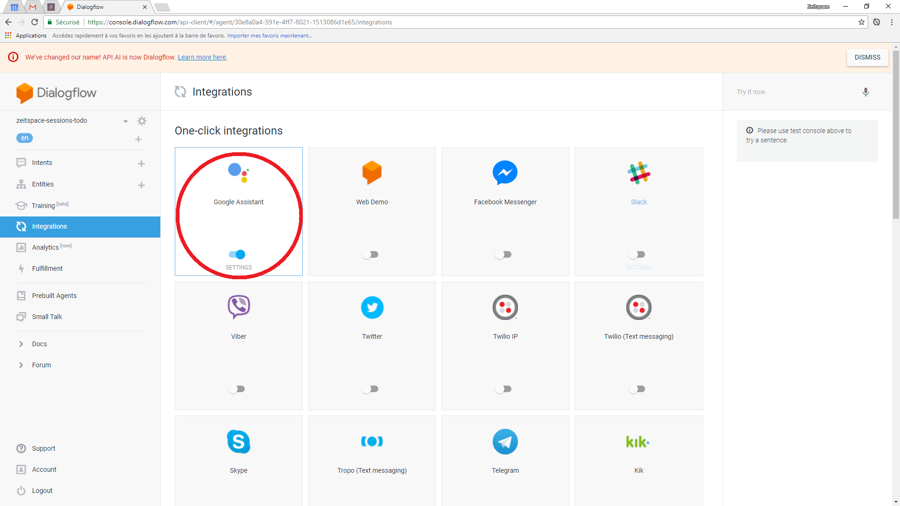

# Create an Actions on Google project

- Visit https://developers.google.com/actions/.
- Click on the "Actions console" button in the top-right corner.
- If necessary, sign in to your Google account.

- Once you've reached the Actions on Google console, click on the "Add/import project" button.

- Give your project a name and choose your country.
- Click on the "Create project" button.

# Connect the Actions on Google project to Dialogflow

- On the overview page for you Actions on Google project, click on the "Build" button in the Dialogflow card.

- In the pop-up that appears, click on the "Create actions on Dialogflow" card.
  - This will open Dialogflow in a new tab.
  - Sign in to Google again if necessary.

- In the tab containing Dialogflow, after signing in to Google, you'll end up on the project creation page.
- Click on the "Save" button.

- After saving the project, you'll be redirected to the Intents page.
- Click on the Integrations page in the menu on the left.

- Double-check that the Google Assistant integration is enabled.
- Click on the Google Assistant card.

- Click on the "Update draft" button.

- Click on the "Close" button.

# Enable Inline Editor

The Inline Editor allows you to deploy and edit Firebase Functions from your browser. We'll use Firebase Functions to create, edit, and delete to-dos that we'll store in Firebase Database.

- Click on the Fulfillment page in the menu on the left.

- Enable the Inline Editor.

- Click on the "Deploy" button.
- This may take a few minutes.
- You can continue with the rest of the setup during the deployment.

- A message will appear when the deployment is finished.

# Enable Small Talk

Dialogflow's Small Talk feature allows your application to respond to simple questions like "How are you?"

- Click on the Small Talk page in the menu on the left.

- Enable Small Talk.

## Bonus: customize your application's small talk!

- Open one of the sections under the heading "Small Talk Customization Progress" and add some custom responses to common questions.

# Test your Actions on Google project

- Switch back to the tab containing Actions on Google.
- Refresh the page if necessary.
- Click on the "Test draft" button.

- Type or say "Talk to my test app" into the simulator on the left of the page.
- To test your application, you may need to enable some permissions on your Google account. If necessary, follow the instructions to enable these permissions.
- Try some small talk, e.g. "How are you?" or "You're so clever."

## Bonus: test out your app on your smartphone!

- This will only work on phones that satisfy [these requirements](https://support.google.com/assistant/answer/7172657?co=GENIE.Platform%3DAndroid&hl=en#requirements).
- Make sure that your phone is signed in to the same Google account that you've used to create the application.
- Touch and hold the Home button or say "OK Google" to activate the Google Assistant.
- Type or say "Talk to my test app".
