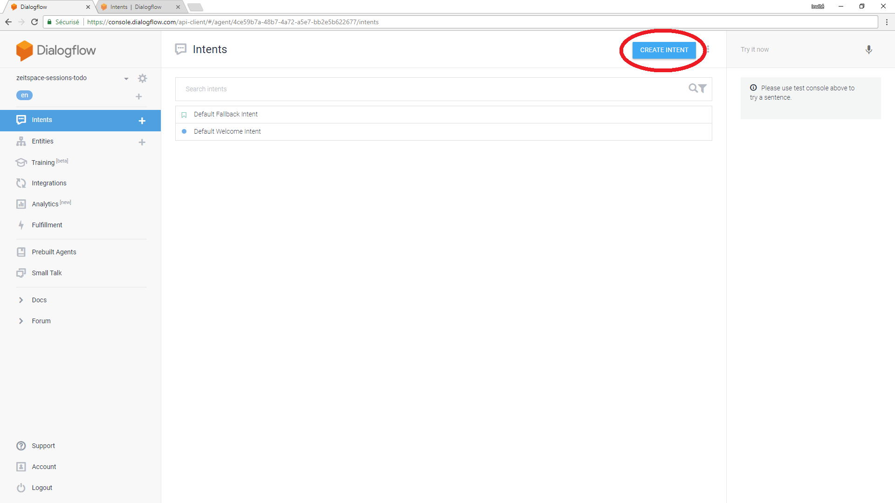
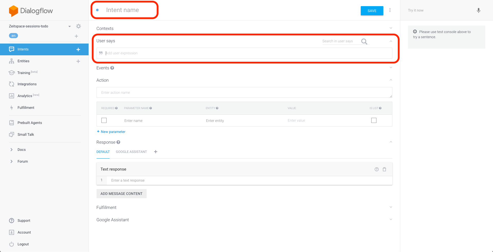
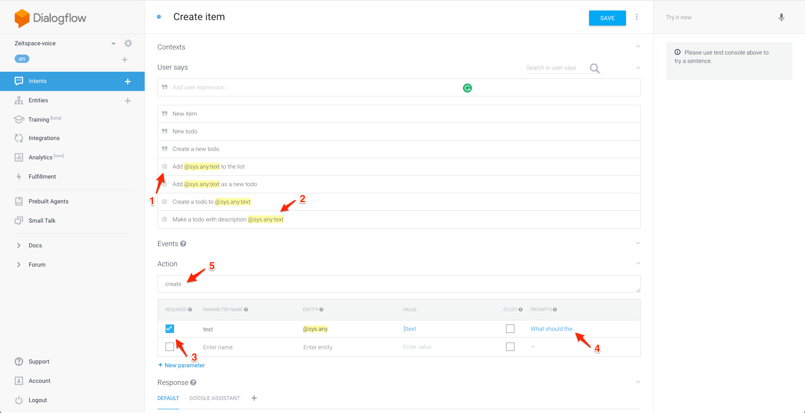
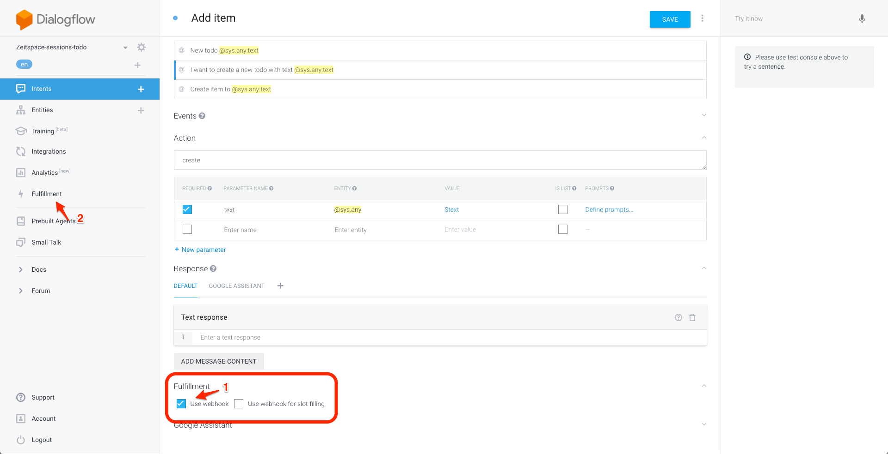
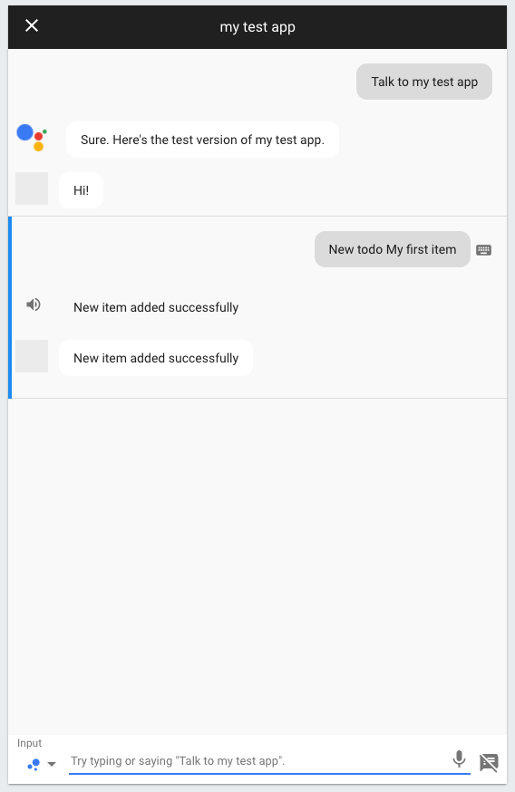
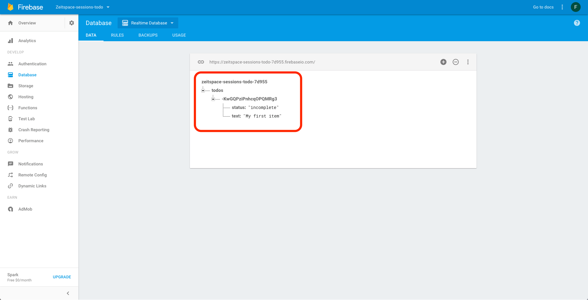

Intents are the backbone of Dialogflow projects. Each intent describes a mapping between what a user says and what action should be taken by your software. In this step, we'll write a "Create item" intent that is invoked when a user wants to add items to their todo list.

# Create a new intent


- Navigate to the Intents page.
- Click on the `Create intent` button.


- Give your intent a name. This can be anything. We are calling ours `Add item`.
- In the `User says` section, add some expressions that you think people would use to create a new item. Here are some examples:
  - Create a new todo
  - New item
  - New todo
  - Make a new item
  - Create a todo
  - Add a new todo
  - Add new item
- Your examples don't have to be comprehensive: Dialogflow automatically combines aspects of the examples you provide to generate new ones. For example, given the examples above, Dialogflow will also invoke your new intent when the user says _"Make new todo"_.


- Click on the quotation mark symbol (`"`) in the left of the `User says` input box. It should be replaced by an `@` symbol.
- You're now in template mode. Try entering these templates:
  - Add `@sys.any:text` as a new todo
  - Add `@sys.any:text` to the list
  - Create a todo to `@sys.any:text`
  - Make a todo with description `@sys.any:text`
- `@sys.any:text` should be highlighted in all examples. This means that, if a user enters _"Create a todo to wash the dishes"_, the intent will be invoked with the parameter `text` set to `wash the dishes`.
- You can see a list of the intent's parameters in the `Action` section. Right now, you only have one parameter: `text`.
- Make the `text` parameter required by checking the checkbox in the leftmost column of the parameter table.
- Click on the `Define prompts` link in the rightmost column of the parameter table.
- Add a prompt for when the user doesn't provide any text for the todo, e.g. _"What is the description of your new todo item?"_ Dialogflow will automatically respond with this prompt when the user tries to invoke this intent without specifying the missing parameter, e.g. by saying _"Create a todo"_.
- Set the action name to `create`.
- Click on the `Save` button.

# Set up webhook fulfillment for the intent


- Open the `Fulfillment` section of the intent editing page.
- Check the `Use webhook` checkbox.
- Navigate to the `Fulfillment` page. Don't forget to save your intent first!
- Insert code to create a new todo item and respond to the user on 'Step 1' section.
```js
var item = parameters['text'];
if (item) {
    todoListRef.push({
        status: "incomplete",
        text: item,
    });
    respond('New item added successfully');
} else {
    respond('Error. You should say the item name');
}
```
- Deploy your new code.

Here is how the code works.
- `var item = parameters[text]` references the parameter we just created under the `Action` section.
- `if (item)` checks if item is non null. If it is non null, then we push a todo item with a completion status and text to Firebase using `todoListRef.push`, where `todoListRef` is a reference to our Firebase database. `respond('...')` then tells Google Assistant to respond with a success message.
- If item is null, then `respond('...')` will tell Google Assistant to respond with an error message.

# Test the intent


- Open the [Actions for Google console](https://console.actions.google.com), select your project, and navigate to the Simulator page.
- In the Actions for Google simulator, type or say _"Talk to my test app"_, then create a new todo using the intent you just created.


- Open the [Firebase Console](https://console.firebase.google.com), select your project, and navigate to the Database page.
- Check that the newly-created todo exists in the database.
