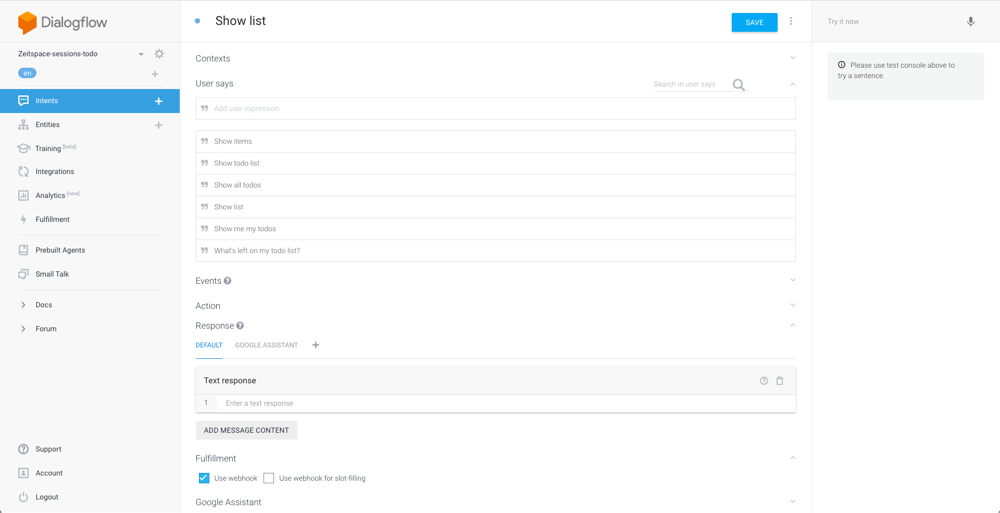

# Create a show list intent


- In the Dialogflow tab, navigate to the Intents page.
- Click on the `Create intent` button.
- Give your intent a name.
- In the `User says` section, add some expressions that you think people would use to show the todo list. Here are some examples:
  - Show list
  - Show me my todos
  - What's left on my todo list?
  - What's on my todo list?
  - Show all todos
  - Show todo list
  - Show items
- Set the action name to `show`.
- Check the `Use webhook` checkbox under the Fulfillment section.
- Click on the `Save` button.

# Set up fulfillment for the intent

- Navigate to the Fulfillment page.
- Insert code to create a new todo item and respond to the user. This code should go after the comment section `// Step 2`.
```js
// Read the todo list out of the database, then call the callback with the value as argument.
todoListRef.once('value', snapshot => {
    const todoList = snapshot.val();
    // Check if the list is empty.
    if (!todoList || Object.keys(todoList).length === 0){
        respond("Your todo list is empty.");
    } else {
        // Create a list of todos, with the completed ones marked with [DONE].
        const listText = Object.keys(todoList)
            .map(key => {
                const { text, status } = todoList[key];
                return `${status === "complete" ? "[DONE] " : ""}${text}`;
            })
            .join(',\n');
        respond(`Here are your todos: ${listText}`);
    }
});
```
- Deploy your new code.

# Test the intent

- In the Actions for Google simulator, type or say _"Talk to my test app"_, then _"Show todo list"_.
