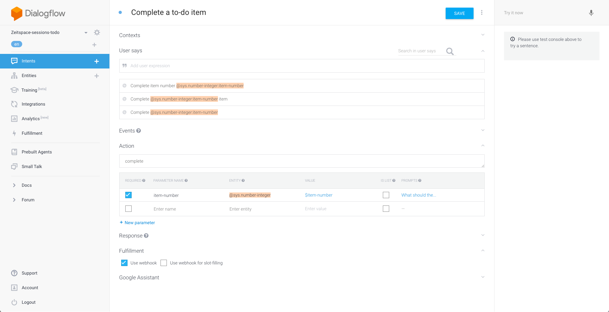

# Create a complete item intent


- In the Dialogflow tab, navigate to the Intents page.
- Click on the `Create intent` button.
- Give your intent a name.
- In the `User says` section, add some expressions that you think people would use to complete a item. Here are some examples:
  - Complete todo number `@sys.number-integer:index`
  - Complete `@sys.number-integer:index`
  - Mark number `@sys.number-integer:index` as complete
  - I've completed number `@sys.number-integer:index`
  - Cross off number `@sys.number-integer:index`
- All the items should be in template mode.
- You can also add some expressions that don't contain the number, and then prompt the user for the number after. Some examples:
  - Complete a todo
  - Cross off a todo item
  - I've completed a todo item
- Enter action name as `complete`.
- Make the "index" parameter required by checking the checkbox in the leftmost column of the parameter table.
- Click on the `Define prompts` link in the rightmost column of the parameter table.
- Add a prompt for when the user doesn't provide any number, e.g. `What is the index of the todo you want to complete?`
- Check the `Use webhook` checkbox under the Fulfillment section.
- Click on the `Save` button.

# Set up fulfillment for the intent

- Navigate to the Fulfillment page.
- Insert code to create a new todo item and respond to the user in the `Step 3` section.
```js
// itemNumber is the index of the specified todo, converted to an integer.
const itemNumber = parseInt(parameters.index);
if (!itemNumber || isNaN(itemNumber)) {
    respond('Error: couldn\'t parse the item number.');
} else {
    // Read the todo list out of the database, then call the callback with the value as argument.
    todoListRef.once('value', snapshot => {
        const todoList = snapshot.val();
        // If todoList is null or undefined, Object.keys(todoList) will throw an error. In this
        // case, we default to an empty object so that keys will be the empty array.
        const keys = Object.keys(todoList || {});
        // Only proceed if todoList exists and itemNumber is between one and the number
        // of items in the todo list.
        if (todoList && itemNumber > 0 && itemNumber <= keys.length) {
            const key = keys[itemNumber - 1];
            let item = todoList[key];
            item.status = 'complete';
            // Update the item's status in the database.
            database.ref(`todos/${key}`).update(item);
            respond(`Completed todo number ${itemNumber}.`);
        } else {
            respond(`There is no todo number ${itemNumber}.`);
        }
    });
}
```
- Deploy your new code.

# Test the intent

- In the Actions for Google simulator, type or say `Talk to my test app`, then complete an item.

[Move on to the next step: Update Item](./04-update-item.md)
