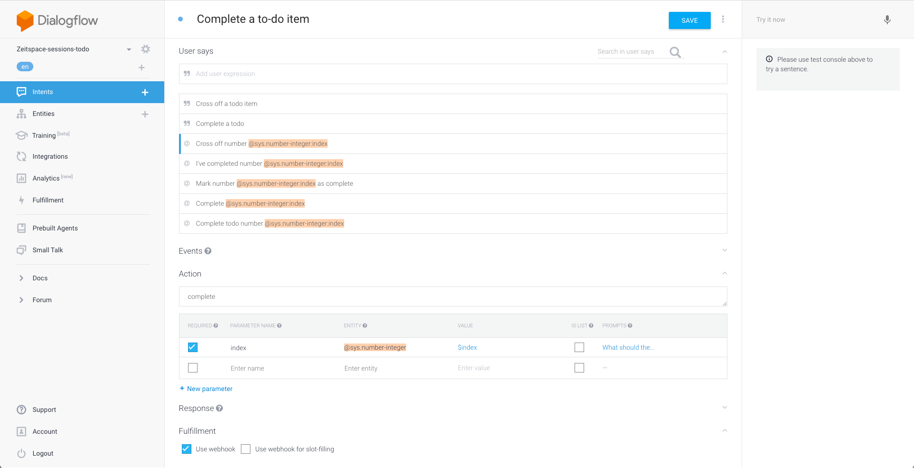

# Create a complete item intent


- In the Dialogflow tab, navigate to the Intents page.
- Click on the `Create intent` button.
- Give your intent a name.
- In the `User says` section, add some expressions that you think people would use to complete a item. Here are some examples:
  - Complete todo number `@sys.number-integer:index`
  - Complete `@sys.number-integer:index`
  - Mark number `@sys.number-integer:index` as complete
  - I've completed number `@sys.number-integer:index`
  - Cross off number `@sys.number-integer:index`
- All the items should be in template mode.
- You can also add some expressions that don't contain the number, and then prompt the user for the number after. Some examples:
  - Complete a todo
  - Cross off a todo item
  - I've completed a todo item
- Enter action name as `complete`.
- Make the "index" parameter required by checking the checkbox in the leftmost column of the parameter table.
- Click on the `Define prompts` link in the rightmost column of the parameter table.
- Add a prompt for when the user doesn't provide any number, e.g. `What is the index of the todo you want to complete?`
- Check the `Use webhook` checkbox under the Fulfillment section.
- Click on the `Save` button.

# Set up fulfillment for the intent

- Navigate to the Fulfillment page.
- Insert code to create a new todo item and respond to the user on `Step 3` section.
```js
var itemNumber = parseInt(parameters['index']);
if (!itemNumber || isNaN(itemNumber)) { respond('Error. Something went wrong.'); }

todoListRef.once('value', snapshot => {
    var todoList = snapshot.val();
    var item;
    var keys = Object.keys(todoList);
    if (itemNumber > 0 && todoList && keys.length >= itemNumber) {
        keys.forEach((key, idx) => {
            if ((itemNumber - 1) === idx) {
                item = todoList[key];
                item.status = 'complete';
                database.ref(`todos/${key}`).update(item);
                return;
            }
        });
    }

    respond(item ? `${item.text} completed` : 'We couldn\'t find this item');
});
```
- Here, we are iterating over the todo list until we find the desired todo item
- Once the item is found, its status is updated to `complete`, and the database is updated
- If the item was not found, an error will be returned

- Deploy your new code.

# Test the intent

- In the Actions for Google simulator, type or say `Talk to my test app`, then complete an item.
