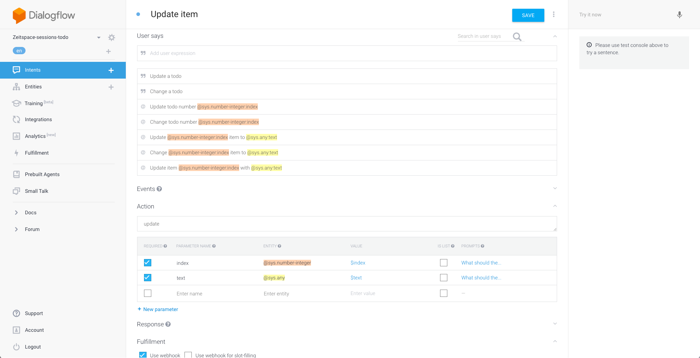

# Create a update item intent


- In the Dialogflow tab, navigate to the Intents page.
- Click on the `Create intent` button.
- Give your intent a name.
- In the `User says` section, add some expressions that you think people would use to show the todo list. Here are some examples:
  - Update item `@sys.number-integer:index` with `@sys.any:text`
  - Change `@sys.number-integer:index` item to `@sys.any:text`
  - Update `@sys.number-integer:index` item to `@sys.any:text`
  - Change todo number `@sys.number-integer:index`
  - Update todo number `@sys.number-integer:index`
- All the items should be in template mode.
- Some other examples for when the user doesn't specify the parameters right away:
  - Change a todo
  - Update a todo
- Enter action name as `update`.
- Make the `index` and `text` parameters required by checking the checkbox in the leftmost column of the parameter table.
- Add prompts for when the user doesn't provide one of the parameters.
- Check the `Use webhook` checkbox under the Fulfillment section.
- Click on the `Save` button.

# Set up fulfillment for the intent

- Navigate to the Fulfillment page.
- Insert code to create a new todo item and respond to the user. This code should go after the comment section `// Step 4`.
```js
const itemNumber = parseInt(parameters.index);
const itemText = parameters.text;

if (!itemNumber || isNaN(itemNumber)) {
    respond('Error: couldn\'t parse the item number.');
} else if (!itemText) {
    respond('Error: no item text specified.');
} else {
    // Read the todo list out of the database, then call the callback with the value as argument.
    todoListRef.once('value', snapshot => {
        const todoList = snapshot.val();
        // If todoList is null or undefined, Object.keys(todoList) will throw an error. In this
        // case, we default to an empty object so that keys will be the empty array.
        const keys = Object.keys(todoList || {});
        // Only proceed if todoList exists and itemNumber is between one and the number
        // of items in the todo list.
        if (todoList && itemNumber > 0 && itemNumber <= keys.length) {
            const key = keys[itemNumber - 1];
            let item = todoList[key];
            item.text = itemText;
            // Update the item's status in the database.
            database.ref(`todos/${key}`).update(item);
            respond(`Todo number ${itemNumber} updated to "${itemText}".`);
        } else {
            respond(`There is no todo number ${itemNumber}.`);
        }
    });
}
```
- Deploy your new code.

# Test the intent

- In the Actions for Google simulator, type or say _"Talk to my test app"_, then _"Update first item with updated item"_.
